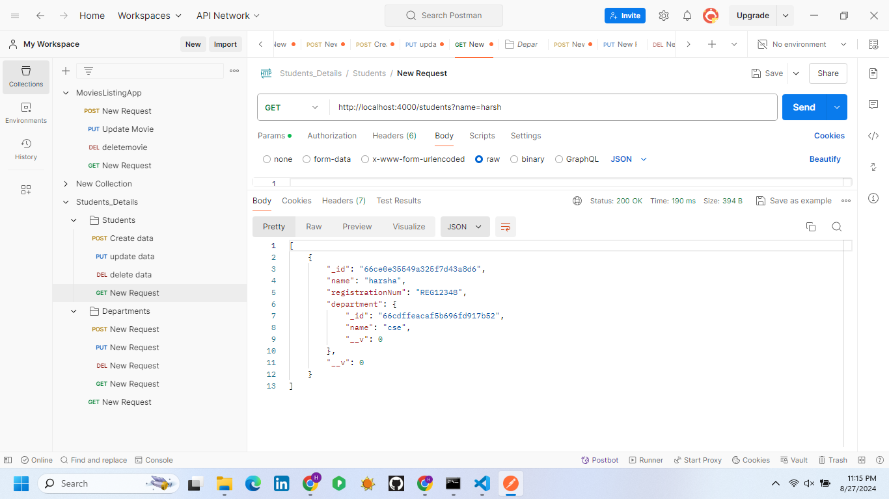
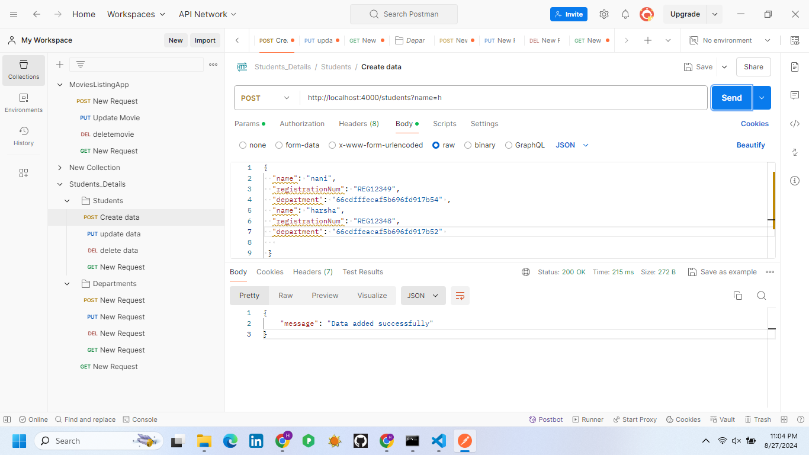
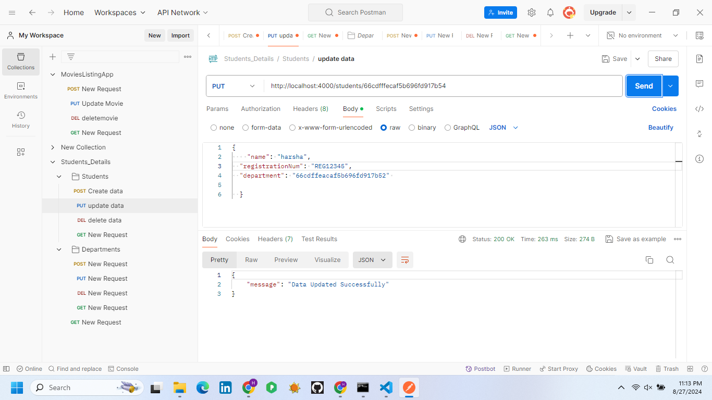
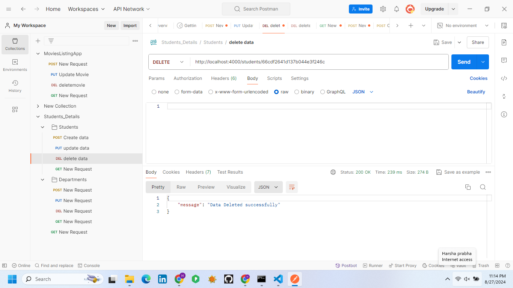
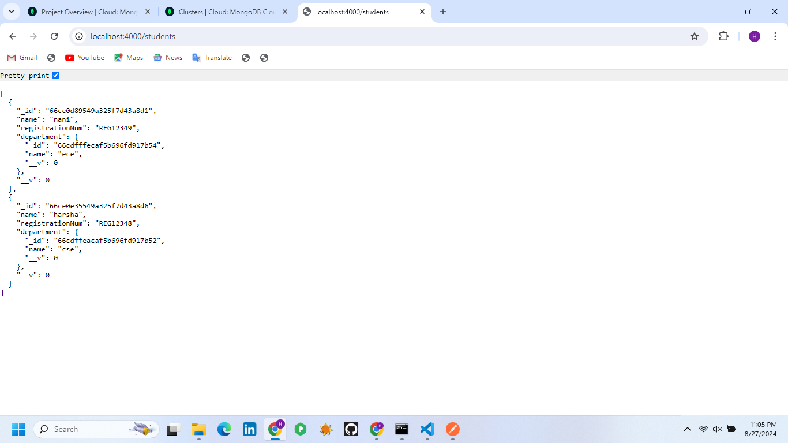
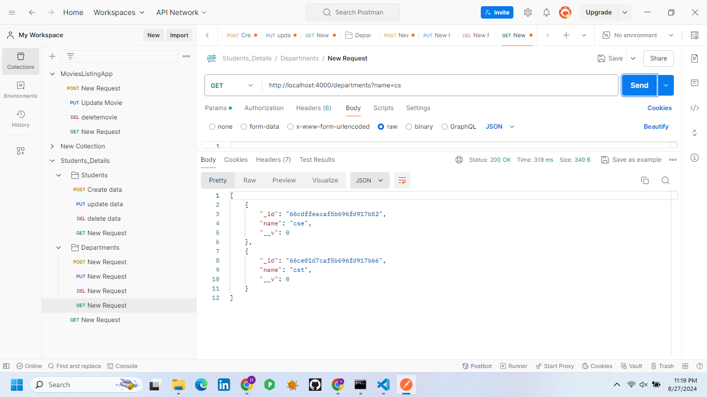
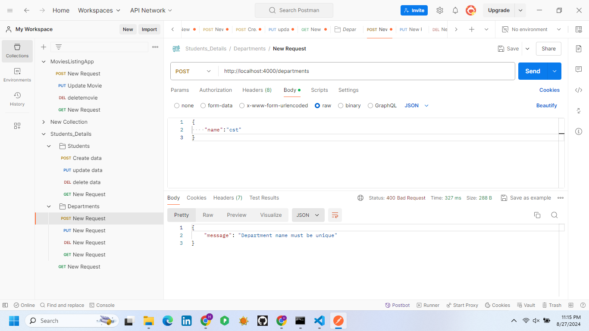
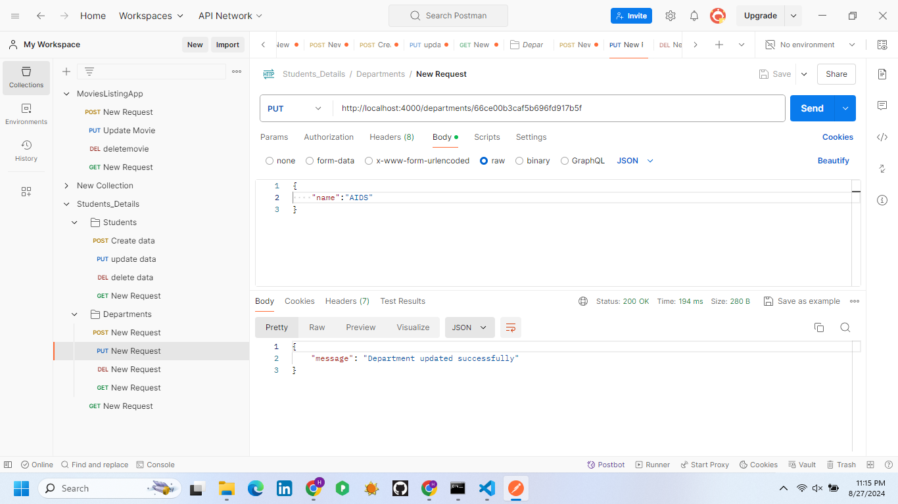
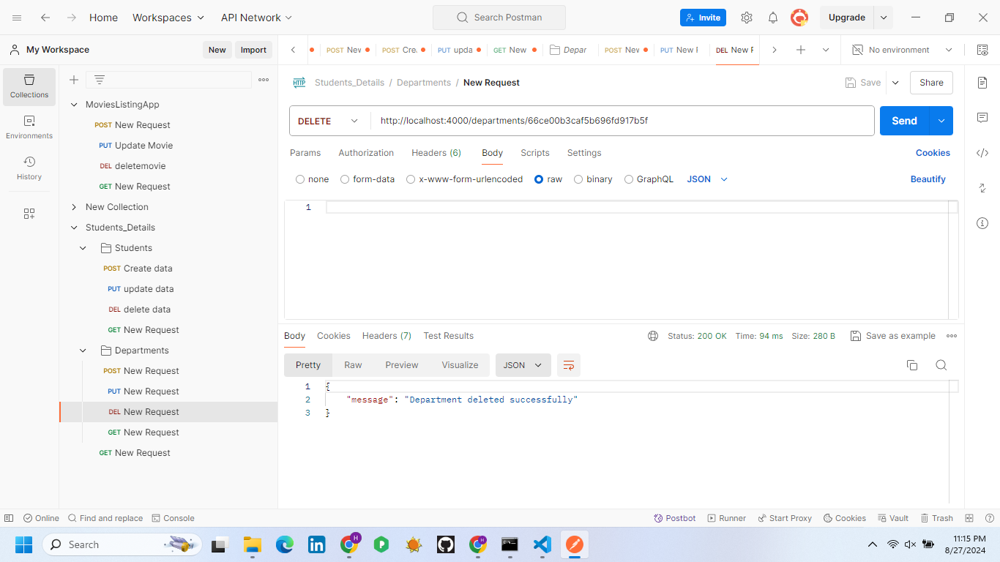

# Students and Departments API
# Overview
 This API allows you to manage students and departments, including creating, listing, updating, and deleting both entities. The API is built using Node.js with Express and MongoDB with Mongoose for database management.
# Features
* List and Search Students: Retrieve a list of students with optional filtering by name and registration number.
* List and Search Departments: Retrieve a list of departments with optional filtering by name.
* Add New Student: Add a new student and map them to a department.
* Add New Department: Create a new department.
* Update Student: Update details of an existing student.
* Update Department: Update details of an existing department.
* Delete Student: Remove a student from the database.
* Delete Department: Remove a department from the database.
* Get Students by Department: Retrieve all students associated with a specific department.
# Prerequisites
* Node.js
* MongoDB
* Postman (for testing the API)
# Installation
* Clone the Repository
git clone <repository-url>
* Navigate to the Project Directory
cd path/to/project
* Install Dependencies
npm install 
* Set Up Environment Variables
Create a .env file in the root directory with the following content:
* env
MONGO_URI=mongodb://localhost:27017/studentsdb
PORT=3000
Adjust MONGO_URI to match your MongoDB connection string.
* Start the Server
npm start
The server will start on http://localhost:4000.
# API Endpoints
## Departments

# List Departments
  * GET /api/departments
  *  Query parameters:
      name: Filter by department name (optional)
     
# Add Department
 * POST /api/departments
     Request body:
{
  "name": "Computer Science"
}

# Update Department
* PUT /api/departments/:id
Request body:
{
  "name": "Electrical Engineering"
 
# Delete Department
DELETE /api/departments/:id
 

 # Final 
  
  
## Students
# List Students
   * GET /api/students
    * Query parameters:
   * name: Filter by student name (optional)
   * registrationNum: Filter by registration number (optional)
    
# Add Student
 POST /api/students
  * Request body:
  {
  "name": "Alice Johnson",
  "registrationNum": "98765",
  "department": "60d21b4667d0d8992e610c85"
  }
   
# Update Student
 PUT /api/students/:id
  * Request body:
 {
  "name": "Alice Johnson",
  "registrationNum": "98765",
  "department": "60d21b4667d0d8992e610c85"
 } 
  
# Delete Student

* DELETE /api/students/:id
   Get Students by Department
   GET /api/students/department/:departmentId
   

# final
 
# Error Handling
 *400 Bad Request: Returned when required fields are missing or validation fails.
 *404 Not Found: Returned when the requested resource does not exist.
 *500 Internal Server Error: Returned for unexpected server errors.
# Testing with Postman
* Set Up Postman: Install Postman if you haven't already.
* Test Endpoints:
   * Create a new request in Postman.
   * Set the request type (GET, POST, PUT, DELETE) and URL.
   * Add required headers (Content-Type: application/json).
   * For POST and PUT requests, include the JSON body in the "Body" tab.
